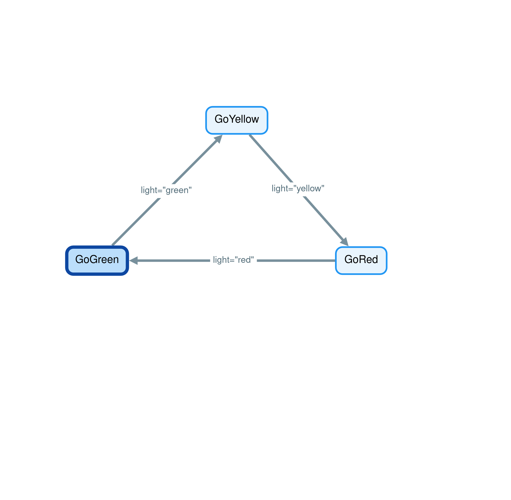

# tla2langgraph

Draw state machines from TLA+ specifications and export [LangGraph](https://langchain-ai.github.io/langgraph/) Python skeletons.

## What it does

1. **Parses** a TLA+ `.tla` file, extracting named sub-actions from the `Next` relation and inferring transitions from variable-value patterns.
2. **Serves** an interactive state-machine diagram in your browser (pan, zoom, click-to-inspect).
3. **Exports** a valid Python skeleton with LangGraph `StateGraph`, `State` TypedDict, and stub node functions — one per TLA+ sub-action.
4. **Exports** the diagram as PNG or SVG for documentation.

## Installation

```bash
pip install tla2langgraph
```

## Quick start

Given a TLA+ spec `traffic_light.tla`:

```tla
---- MODULE TrafficLight ----
VARIABLES light

Init == light = "red"

GoGreen  == /\ light = "red"    /\ light' = "green"
GoYellow == /\ light = "green"  /\ light' = "yellow"
GoRed    == /\ light = "yellow" /\ light' = "red"

Next == GoGreen \/ GoYellow \/ GoRed
====
```

Run:

```bash
tla2langgraph traffic_light.tla
# tla2langgraph: serving on http://127.0.0.1:52341
# tla2langgraph: opening browser...
# tla2langgraph: press Ctrl+C to stop
```

Your browser opens with an interactive diagram:



Click any node to inspect its guards and effects. Click **"Export Python skeleton"** to download the generated LangGraph file.

## Options

| Flag | Default | Description |
|------|---------|-------------|
| `--port INTEGER` | `0` (auto) | Port for the local web server |
| `--no-browser` | `False` | Start server without opening the browser |
| `--version` | — | Print version and exit |
| `--help` | — | Show help |

## TLA+ subset supported

The tool handles specs where:
- The state machine is expressed as **named sub-actions** under a top-level `Next` relation
- Transitions are encoded as `var' = V` (effect) in one action and `var = V` (guard) in another

Full PlusCal, temporal operators, and TLC model-checking are **out of scope** for v1.

## Full documentation

See [`specs/001-tla-to-langgraph/quickstart.md`](specs/001-tla-to-langgraph/quickstart.md) for detailed usage, troubleshooting, and CI integration.

## Development

```bash
uv sync --extra dev
uv run pytest                       # run all tests (≥90% coverage required)
uv run ruff check src/              # lint
uv run mypy --strict src/           # type check
```

## License

MIT
